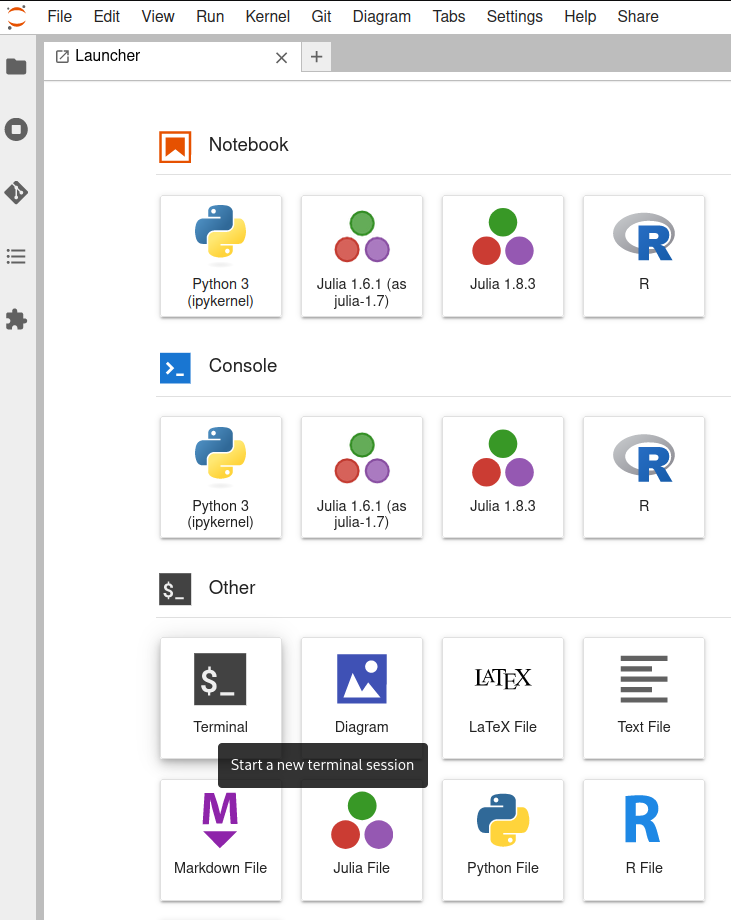
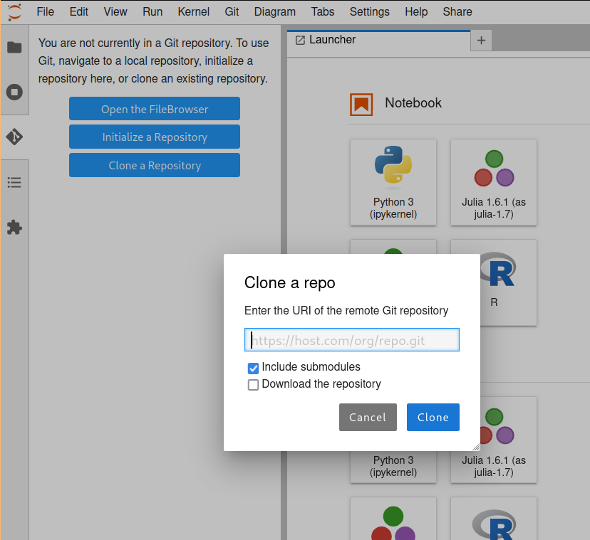

# Tips

## Authenticating to GitHub on https://coding.csel.io

This is a one-time process to use the Jupyter sidebar (or `gh` client) to clone repositories and interact with GitHub. 

### 1. Log in
Open https://coding.csel.io and select the CSCI-3656/Numerical Computation tile.

### 2. Open a terminal


### 3. Run `gh auth login`
At the terminal, enter `gh auth login` and accept defaults for all questions. When it prints an 8-character one-time code, press enter one more time. The session should look like this:
```console
jovyan@jupyter-jeka2967:~$ gh auth login
? What account do you want to log into? GitHub.com
? What is your preferred protocol for Git operations? HTTPS
? How would you like to authenticate GitHub CLI? Login with a web browser

! First copy your one-time code: 54E0-8759
Press Enter to open github.com in your browser... 
/usr/bin/xdg-open: 882: www-browser: not found
/usr/bin/xdg-open: 882: links2: not found
/usr/bin/xdg-open: 882: elinks: not found
/usr/bin/xdg-open: 882: links: not found
/usr/bin/xdg-open: 882: lynx: not found
/usr/bin/xdg-open: 882: w3m: not found
xdg-open: no method available for opening 'https://github.com/login/device'
! Failed opening a web browser at https://github.com/login/device
  exit status 3
  Please try entering the URL in your browser manually
```

### 4. Open https://github.com/login/device
In a new browser tab, open https://github.com/login/device and enter the 8-character code. If configured, it may also ask for your 2-factor authentication (app on your phone). The browser should say "Congratulations, you're all set!" and the terminal session should complete. 
```console
✓ Authentication complete.
- gh config set -h github.com git_protocol https
✓ Configured git protocol
✓ Logged in as jedbrown
```

### 5. Clone with the Git sidebar
You can now clone with the Git sidebar or `gh repo clone`.


## Installing IJulia locally

### 1. Install Julia

If you use a package manager, you can get Julia that way, otherwise install `juliaup` (the Julia version manager/dispatcher) by following the [official install instructions](https://julialang.org/install/).

### 2. Install IJulia

[IJulia](https://github.com/JuliaLang/IJulia.jl) includes the Jupyter system (which is implemented in Python) and connects it to the Julia "kernel".
You can install it by running `julia`, which will give you a Julia prompt:

```
julia>
```

Press the `]` key to enter the packaging prompt, which will look like:

```
(@v1.11) pkg>
```

Enter `add IJulia` to install:

```
(@v1.11) pkg> add IJulia
```

If this completes with errors, you're done. Pressing the backspace key will return you to a standard `julia>` prompt, and you can enter the notebook using

```
julia> using IJulia
julia> notebook()
```

This will open a browser window.

### 3. Install Plots and any other necessary packages

Our work will sometimes use community packages that are not shipped with the Julia base system.
The first of these is [Plots](https://docs.juliaplots.org/), which you can install with
```
(@v1.11) pkg> add Plots
```
